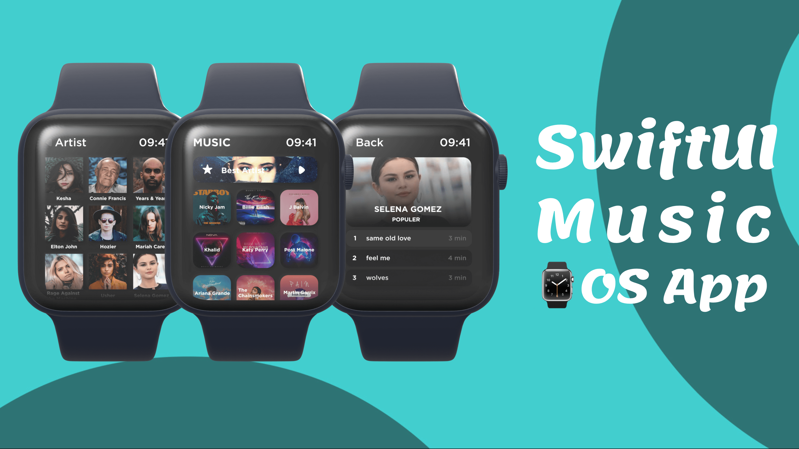

# Music App UI for Apple Watch - SwiftUI

## [Watch it on YouTube](https://youtu.be/nY9e_yGlWaU)

In this video we create three screens for music app that run on your apple watch for that we use SwiftUI. On home screen it shows a banner at top then a grid view of popular artists. Then there is a artist screen where you can find your favourite atritst. At the end we create a songs screen with work for both means for any atrist or album.

### Music App UI for Apple Watch Final UI

